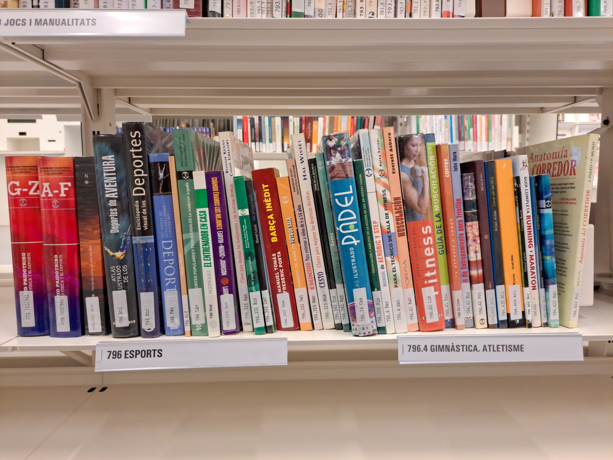
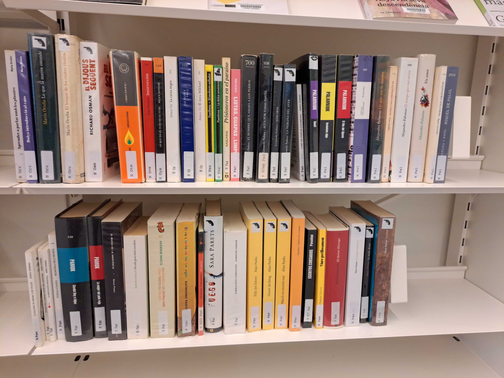

# Library Dataset: Image-text matching for large-scale book collections

The Library Dataset consists of 285 high resolution images of bookshelves with a total 7,536 books. We also provide two book catalogues for matching, the true library inventory (closed-set scenario) and a large-scale catalogue (open-set scenario).

One Shelf Example             |  Two Shelves Example
:-------------------------:|:-------------------------:
  |  

## Dataset

### Target Lists
- [True Library Inventory](data/target_lists/library_books.csv) - `data/target_lists/library_books.csv`: List of 15,229 books in the library. Contains the following columns:
  - `title`: Title of the book.
  - `author`: Author of the book.
  - `tag`: Non-unique identifier used by the library, it is present on all book-spines in as black text on a white background.
  - `series`: For books that belong to a series, the name of the series.
  - `ISBN`: International Standard Book Number.

The Large-Scale Catalogue must be downloaded from [here](https://cvcuab-my.sharepoint.com/:u:/g/personal/allabres_cvc_uab_cat/ETEdq8Q803tAiRmwypHSnPUBv0tlF_B9pQsJJVB61lRyqw?e=B6gDqb).
- [Large-Scale Catalogue](data/target_lists/all_books.csv) - `data/target_lists/all_books.csv`: Contains the following columns:
  - `title`: Title of the book.
  - `author`: Author of the book  - `series`: For books that to a series, the name of the series.
  - `language`: Language of the book.

  
### Annotations
The main annotation for this dataset is the books that appear in each image. The annotations are stored in the following file:

[Annotations](data/annotations/library_books_annotations.csv) - `data/annotations/library_books_annotations.csv`

### Images

There are two sets of images, original, and split. The split images where created by cutting the original images to reduce size in order to fit in the OCR API size limits.
Both sets of images can be downloaded from the following links:
- [Original Images](https://cvcuab-my.sharepoint.com/:u:/g/personal/allabres_cvc_uab_cat/EeLjfNfMHItDps97t7xZ7UgBW-xBnuewRbHGEUmGsMpEFg?e=Fnn2Eq)
- [Split Images](https://cvcuab-my.sharepoint.com/:u:/g/personal/allabres_cvc_uab_cat/ES2oBS5DuhROlKbHQIGS0akBQuG3KO_8c5QNd27QhZaYOg?e=Y6XTyz)

Unzip the images in `data/images/`.

## Demos

Check out the demos at `demos/`:

- [Book Search Demo](demos/search_demo/README.md): This demo prompts the user to input a book title or author name, and returns the image where the book has been detected.

