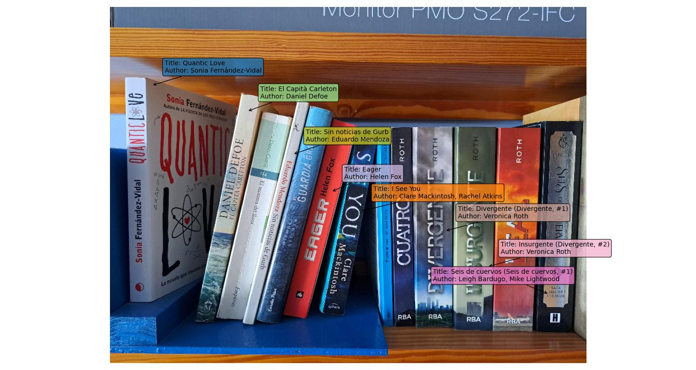

# Book Identification Demo

Given an image of a bookshelf, this demo identifies the books present in the image.



## Usage

1. Download the necessary model weights and embeddings from [this link](COMING_SOON).
2. Unzip the downloaded folder in this directory.
3. In `main.py`, set your Amazon Rekognition credentials in the following lines:
```python
# Setting Up Amazon Rekognition OCR
key="YOUR KEY HERE"
secret_key="YOUR SECRET KEY HERE'

```
4. Run `python book_identification_demo.py --image_path PATH_TO_YOUR_IMAGE.jpg` to start the book identification demo.
