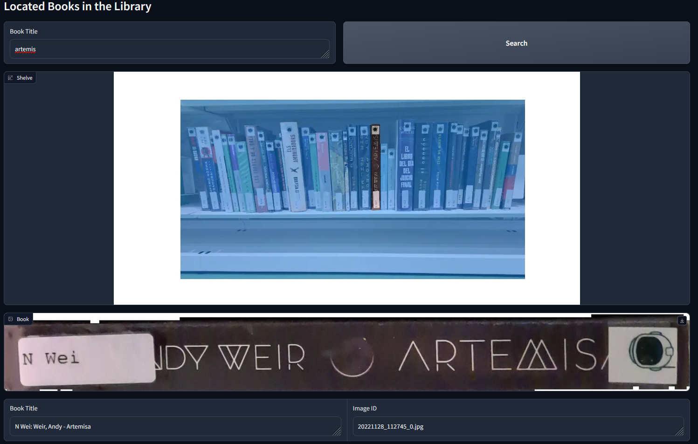

# Book Search Demo

This demo prompts the user to input a book title or author name, and returns the image where the book has been detected.

## Usage

1. Ensure that images has been downloaded and saved at `/data/images`
2. Download the file `book_preds.npy` from [this link](https://cvcuab-my.sharepoint.com/:u:/g/personal/allabres_cvc_uab_cat/EafeJuneiPNKkFOHQ4YkKGgBvkUYftdtwR7FWIqCWKkGUw?e=KrVcdL)
3. Run `python search_demo.py` to start the search demo.